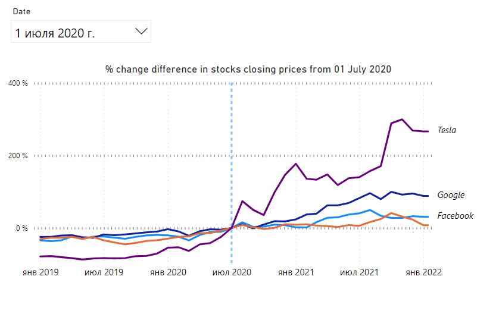

# Below graph displays percentage change difference in stock prices from a specified date

The base value is the closing price of a stock for a date selected by user (dashed line).



I found two nuances when doing this dash:
1) the code for a percentage change measure:  
```_% change =   
VAR SelectedDate = SELECTEDVALUE('Reference_date'[Date])  
VAR _start = CALCULATE(MAX('Stocks'[Close]), 'Stocks'[Date] = SelectedDate)  
VAR _end = MAX('Stocks'[Close])  
RETURN  
DIVIDE(_end -_start,_start)_ 
```

2) I needed to turn off the Date/Time Intelligence option in the options settings for the graph to work


You may find the input data [here](https://data.world/missdataviz/wow22w3-stocks-jan22/) 
